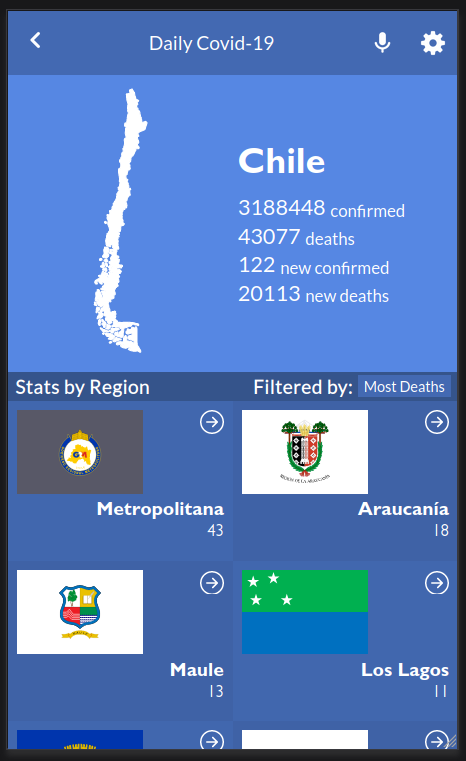

# Covid 19 Monitor

> Web page that shows the covid statistics of the country of Chile, all the confirmed cases, the deaths and also the daily statistics.
> It also shows the covid statistics of each region of the country, and its flag.
> This is the capstone project for the third Microverse module, React and Redux.

## Built With

- JavaScript, CSS
- React, Redux
- Webpack

## Live Demo

Check the live demo for this project [here](https://covid-19-monitor2.netlify.app/).

## Getting Started

To get a local copy up and running follow these simple example steps.

### Prerequisites

You need to be able to use **Node Package Manager**, or also called, the `npm` command.
If you dont have it, install it with these commands in the CLI (for Linux):

`curl -sL https://deb.nodesource.com/setup_12.x | sudo -E bash -`

`sudo apt install nodejs`

Then, run this command in the CLI:

`npm --version`

If the previous command prints a single line with a version number on screen, `npm` was installed.
### Install

First you need to clone the repository into the folder of your choice with this command:

`git clone https://github.com/Yothu/covid-19-monitor.git`

Then go inside the repository foler with this command:

`cd covid-19-monitor`

After you are inside, download the `npm` dependecies with this command:

`npm install`

Finally, show the project through the browser with this command:

`npm start`

### Usage

+ Once in the browser, you will see the **Home page**, in it you will see two sections, the *country section* and the *regions section*, in the first one you will se the map of the country the covid app is based in, and also its covid statistics. On the *regions section* you will see all the regions of the country listed, you can filter them by today's `confirmed` cases and `deaths`.
+ Once you click on a region you will be redirected to the **details page**, in it there are the covid statistics of that region, showing the region's flag, and statistics.
+ You can press the left arrow in the header to go back to the **Home page**.

## Author

👤 David Vergaray

- GitHub:   [@Yothu](https://github.com/Yothu)
- Twiter:   [@Daivhy](https://twitter.com/Daivhy)
- LinkedIn: [David Vergaray](https://www.linkedin.com/in/david-vergaray-almontes-051a11127/)

## 📝 License

This project is [MIT](./MIT.md) licensed.

## Show your support

Give a ⭐️ if you like this project!
